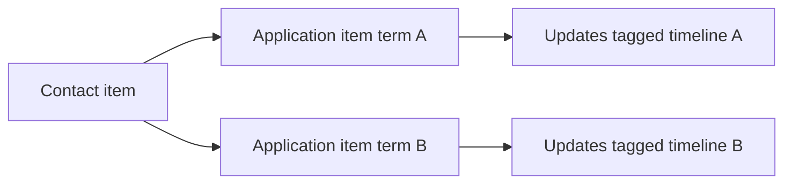

# Term-scoped internal notes

Coordinators add **internal notes** on the volunteer detail view. Each note is stored on the monday.com **application item** as an item update, tagged by **term of service** (`timelineId` from the Signup Timeline column).

## Storage format

Each note is created with `createUpdate` using this body:

```text
[CRM_TERM_NOTE timeline=summer-2026-a]
Coordinator note text here...
```

- `timeline` is the internal id from `src/data/timelines.ts` (not the display label).
- The **Application Timeline** panel shows only updates **without** this prefix.
- The **Internal notes** chat shows only updates matching the volunteer’s current `timelineId`.

Implementation: `src/services/termNotes.ts` (`encodeTermNoteBody`, `parseTermNotes`, `isTermNoteUpdate`).

## OAuth

The app needs **`updates:write`** in addition to `updates:read`. See [crm-board-view-setup.md](./crm-board-view-setup.md).

## Mock / offline mode

When `VITE_USE_MOCK_DATA=true` or the item id starts with `mock-`, notes persist in the browser:

```text
localStorage key: crm-term-notes:{itemId}:{timelineId}
```

## Edge cases

| Case | Behavior |
|------|----------|
| Notes on term A | Only shown when viewing an application with that term’s `timelineId` |
| Same person returns on term B | Separate thread (new item or new timeline); old notes stay on old item/timeline |
| Timeline column changed after notes | Notes remain keyed by the tag at write time; filter uses `timeline=` in the tag |
| Legacy “Internal Notes” column | Not shown in UI; optional import is out of scope |

## Future: Contacts page

Foundation for a **Contacts** view (not built yet):

1. Add a **Contact** link column on the Applications board (column name TBD).
2. A contact item links to one or more application items (one per term).
3. UI: accordion per `VolunteerTerm` (label, dates, status) with `TermNotesChat` per term.
4. Service: `fetchContactTerms(contactId)` → `VolunteerTerm[]` with `notes` from `parseTermNotes` on each linked item’s updates.



Types: `VolunteerTerm` and `TermNote` in `src/types/volunteer.ts`.
