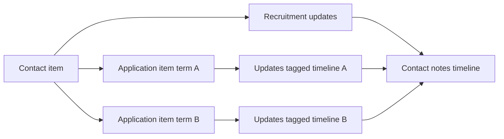

# Term-scoped internal notes

Coordinators add **internal notes** on the volunteer detail view. Each note is stored on the monday.com **application item** as an item update, tagged by **term of service** (`timelineId` from the Signup Timeline column).

## Storage format

Each note is created with `createUpdate` using this body:

```text
[CRM_TERM_NOTE timeline=summer-2026-a]
Coordinator note text here...
```

- `timeline` is the internal id from `src/data/timelines.ts` (not the display label).
- The **Application Timeline** panel shows only updates **without** this prefix.
- The **Internal notes** chat shows only updates matching the volunteer’s current `timelineId`.

Implementation: `src/services/termNotes.ts` (`encodeTermNoteBody`, `parseTermNotes`, `isTermNoteUpdate`).

## OAuth

The app needs **`updates:write`** in addition to `updates:read`. See [crm-board-view-setup.md](./crm-board-view-setup.md).

## Mock / offline mode

When `VITE_USE_MOCK_DATA=true` or the item id starts with `mock-`, notes persist in the browser:

```text
localStorage key: crm-term-notes:{itemId}:{timelineId}
```

## Edge cases

| Case | Behavior |
|------|----------|
| Notes on term A | Only shown when viewing an application with that term’s `timelineId` |
| Same person returns on term B | Separate thread (new item or new timeline); old notes stay on old item/timeline |
| Timeline column changed after notes | Notes remain keyed by the tag at write time; filter uses `timeline=` in the tag |
| Legacy “Internal Notes” column | Not shown in UI; optional import is out of scope |

## Contact hub writes (Contacts board only)

Notes added from the **contact page** are stored on the **Contacts item** only:

```text
[CRM_CONTACT_NOTE source=recruitment prospect={prospectId}]
Note body...

[CRM_CONTACT_NOTE source=term timeline={timelineId} application={applicationItemId}]
Note body...
```

Legacy formats `[CRM_RECRUITMENT_NOTE …]` and Applications-board `[CRM_TERM_NOTE …]` are still **read** for history.

## Note review inbox

Harvested monday updates that are not already CRM-tagged are matched to contacts using strict rules (board relation, exact email, CRM tags, or Contacts board item) — never fuzzy name matching. Notes with a strict match are **auto-approved** on sync and appear on the contact immediately. The inbox is only for unmatched notes; use **Approve all matched** to clear any pending items that already have a suggested contact from a prior harvest.

## Contact internal notes hub

On the **Contacts** detail page, all internal notes appear in one timeline:

| Source | Stored on | Tag format |
|--------|-----------|------------|
| Contact page (new writes) | Contacts board item | `[CRM_CONTACT_NOTE source=…]` |
| Service term (legacy read) | Applications board item | `[CRM_TERM_NOTE timeline=…]` |
| Recruitment (legacy read) | Contacts board item | `[CRM_RECRUITMENT_NOTE prospect=…]` |
| Approved harvest | localStorage link | Shown with board source pill |

**Contact-page writes go to the Contacts board only** — not Applications.

Implementation: `src/services/contactInternalNotes.ts`, `src/services/fetchContactInternalNotes.ts`, `ContactInternalNotesSection`.

Recruitment notes previously in localStorage are migrated to the Contacts item on first load (text notes only; attachments stay local).

## Contacts page (built)

1. Contact item links to application items via board relations / email match.
2. UI: unified **Internal notes** timeline on contact detail; per-term `TermNotesChat` in service record overlay.
3. Service: `fetchContactInternalNotes(contactId, serviceTerms)` aggregates updates from Contacts + linked Applications items.



Types: `VolunteerTerm`, `TermNote`, and `ContactInternalNote` in `src/types/`.
